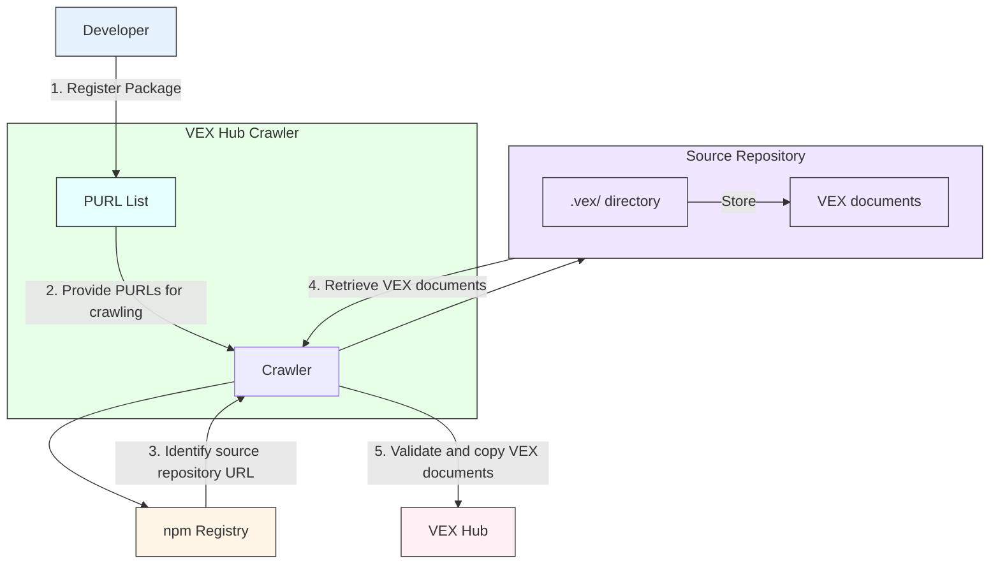

# VEX Hub Crawler

`vexhub-crawler` is a component of the [VEX Hub][vexhub] that automatically retrieves VEX documents from source repositories.

## Overview

The crawler identifies source repositories from registered [PURLs (Package URLs)][purl] and copies VEX documents into VEX Hub.
This process ensures that VEX Hub maintains an up-to-date collection of VEX documents for various software packages.

The following diagram illustrates the high-level process flow of the VEX Hub Crawler, using npm as an example:



## Registering PURLs

VEX Hub Crawler maintains [a list of PURLs](./crawler.yaml) for discovering VEX documents.
The PURL definition file format is as follows:

```yaml
pkg:
  npm:
    - namespace: "@angular"
      name: animations
  golang:
    - name: github.com/aquasecurity/trivy
  pypi:
    - name: django
  maven:
    - namespace: org.junit.jupiter
      name: junit-jupiter-api
  oci:
    - name: trivy
      qualifiers:
         - key: repository_url
           value: index.docker.io/aquasec/trivy
    - name: trivy
      qualifiers:
        - key: repository_url
          value: ghcr.io/aquasecurity/trivy
```

When specifying PURLs, the following components are required:

* type
* name

The `version` must be omitted.
The `namespace`, `qualifiers` and `subpath` may be necessary for certain ecosystems, such as `oci`.
For detailed information about PURL composition, please refer to the PURL [specification](https://github.com/package-url/purl-spec/blob/b33dda1cf4515efa8eabbbe8e9b140950805f845/PURL-SPECIFICATION.rst).

[The list of PURLs](./crawler.yaml) can be updated by anyone through Pull Requests.
If VEX documents are already stored in the source repository of an open-source project, individuals other than the project's maintainers are welcome to register the PURL in VEX Hub.

Currently, the crawler supports the following ecosystems:

- npm
- Go
- PyPI
- Maven
- Cargo
- OCI

## Identifying Source Repositories

The method for identifying source repositories varies by ecosystem:

### npm

The npm registry API will be used to resolve the source repository.
Each package has a section to [define the repository](https://github.com/npm/registry/blob/master/docs/responses/package-metadata.md#repository).

For the example of React, it would be as follows:

```bash
$ curl -s https://registry.npmjs.org/react | jq .repository.url
"git+https://github.com/facebook/react.git"
```

vexhub-crawler will automatically retrieve the VEX files stored in `https://github.com/facebook/react`.

### Go
An HTTP access will be made to identify the repository from `go-import`.

```bash
curl -s "https://k8s.io/client-go?go-get=1"

            <html><head>
                  <meta name="go-import"
                        content="k8s.io/client-go
                                 git https://github.com/kubernetes/client-go">
                  <meta name="go-source"
                        content="k8s.io/client-go
                                 https://github.com/kubernetes/client-go
                                 https://github.com/kubernetes/client-go/tree/master{/dir}
                                 https://github.com/kubernetes/client-go/blob/master{/dir}/{file}#L{line}">
            </head></html>
```

### PyPI

The PyPI API will be used to resolve the repository.

```bash
curl -s https://pypi.org/pypi/<package-name>/json | jq .info.project_urls.Source
```

### Cargo

[The crates.io API](https://crates.io/data-access#api) will be used to resolve the repository.

```bash
curl -s https://crates.io/api/v1/crates/<crate-name> | jq .crate.repository
```

### Maven

For Maven packages, it follows these steps to identify the source repository:

1. First, obtain the `repository_url` based on the [PURL specification](https://github.com/package-url/purl-spec/blob/b33dda1cf4515efa8eabbbe8e9b140950805f845/PURL-TYPES.rst#maven). The default URL is `https://repo.maven.apache.org/maven2`.
2. Then construct the URL for the `maven-metadata.xml` file using the namespace and name from the PURL. For example, for `com.fasterxml.jackson.core:jackson-databind`, the URL would be: https://repo.maven.apache.org/maven2/com/fasterxml/jackson/core/jackson-core/maven-metadata.xml.
3. Extract the latest version from the `maven-metadata.xml`,
4. Using this version, download the corresponding POM file. For instance, if the latest version of jackson-databind is 2.17.1, the POM URL would be: https://repo.maven.apache.org/maven2/com/fasterxml/jackson/core/jackson-core/2.17.1/jackson-core-2.17.1.pom
5. Finally, identify the source repository by examining the `scm.url` or `url` field within the POM file.

### OCI Images

For OCI images, the source repository is identified by examining the `org.opencontainers.image.source` label or annotation of the `latest` tag.
The metadata is typically set during the image build process and provides a standardized way to reference the source code repository.

The process is as follows:

1. For the given PURL, construct the full image reference by appending `repository_url` and the `:latest` tag.
2. Retrieve the image manifest and configuration for the `latest` tag.
3. Look for the `org.opencontainers.image.source` key in the following locations:
    - Image config's `Labels` field
    - Image manifest's `annotations` field

Example of retrieving the source URL using [crane](https://github.com/google/go-containerregistry/blob/main/cmd/crane/doc/crane.md):

```sh
$ crane config ghcr.io/aquasecurity/trivy:latest | jq -r '.config.Labels["org.opencontainers.image.source"]'
https://github.com/aquasecurity/trivy
```

## Discovery of VEX Documents

Once the source repository is identified (currently only git repositories are supported), `vexhub-crawler` searches for VEX documents in the `.vex/` directory at the root of the repository.

The crawler considers files matching the following patterns as VEX documents:

- *.csaf.json
- *.openvex.json
- *.vex.json
- .openvex.json
- vex.json

## Validation

The crawler performs the following validations:

1. Verifies that the PURL written in the retrieved VEX matches the one registered in VEX Hub.
2. If not, the document is considered unrelated and ignored.

## VEX Hub Directory Structure

The crawler copies the discovered files to VEX Hub with their original filenames.
The directory structure in VEX Hub is created based on the Package URL (PURL), **excluding version, qualifiers and subpath**.

## Rationale

### Trustworthiness

The crawler adopts a trust model based on VEX documents stored in source repositories.
As mentioned in the Validation section, it filters out VEX documents that declare products different from the original PURL.

For example, if a PURL `pkg:npm/malicious` is registered in VEX Hub and resolves to the source repository `github.com/org/malicious`, any VEX documents stored there must have a product ID of `pkg:npm/malicious`.
VEX documents with different product IDs, such as `pkg:npm/foobar@12.3.1`, will be ignored.

This approach ensures that only relevant and trustworthy VEX documents are included in VEX Hub.

## Future Work
### More Reliable Source Repository Resolution

Currently, VEX Hub Crawler uses registry APIs to identify package source repositories.
However, this approach has potential security risks as repository information can be freely set by package maintainers, making it susceptible to tampering.

To address this challenge, we are considering using provenance attestation for more reliable source repository resolution in the future.
Provenance attestation allows for obtaining the actual repository URL where a package was built in a trustworthy manner, enabling cryptographic verification of the relationship between a package's source code and its published artifacts.

Notably, npm has already implemented provenance in its registry.
This implementation makes it possible to retrieve the source repository information directly from the PURL using provenance data.
We believe this approach can enhance the trustworthiness of the source repository resolution process for packages.

[vexhub]: https://github.com/aquasecurity/vexhub
[purl]: https://github.com/package-url/purl-spec